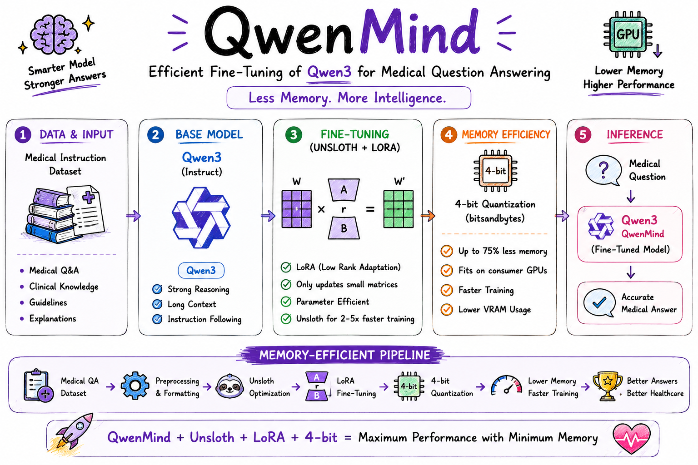

# QwenMind - Less Memory. More Intelligence.

### Efficient Fine-Tuning of Qwen3 for Medical Question Answering using Unsloth.

  

<h1 align="center">QwenMind</h1>

<h3 align="center">
Efficient Fine-Tuning of Qwen3 for Medical Question Answering using Unsloth
</h3>

  
  
  
  
  
  

---

# Overview

**QwenMind** is a Medical Question Answering (Medical QA) model developed by fine-tuning **Qwen3** using **Unsloth** on a medical instruction dataset. The project focuses on memory-efficient adaptation through LoRA and 4-bit quantization, enabling faster training, reduced GPU memory consumption, and accurate healthcare-focused response generation.

---

# Features

* Medical Question Answering
* Fine-tuned Qwen3
* Efficient Fine-Tuning with Unsloth
* LoRA-based Parameter-Efficient Fine-Tuning
* 4-bit Quantization
* Memory-Efficient Training
* Context-Aware Medical Responses
* Faster Inference
* Ready for Deployment

---

# Applications

* Medical Question Answering
* AI Healthcare Assistants
* Patient Education
* Clinical Knowledge Support
* Medical Information Retrieval
* Healthcare Research
* Medical Chatbots

---

# Model Efficiency

**Qwen3**, together with **Unsloth**, enables efficient fine-tuning through optimized kernels, LoRA, and 4-bit quantization. This significantly reduces GPU memory usage while maintaining strong reasoning and instruction-following capabilities, making it ideal for training and inference on consumer-grade GPUs.

### Benefits

* Faster Fine-Tuning
* Lower GPU Memory Usage
* Efficient LoRA Training
* 4-bit Quantization Support
* Faster Inference
* High-Quality Medical Responses

---

# Why Qwen3 + Unsloth?

Large Language Models often require substantial computational resources for domain-specific fine-tuning. By combining **Qwen3** with **Unsloth**, this project demonstrates an efficient workflow that minimizes GPU memory consumption while preserving strong reasoning capabilities for Medical Question Answering.

### Highlights

* Memory-efficient fine-tuning
* Faster training with Unsloth
* LoRA-based parameter-efficient adaptation
* Lower GPU memory requirements
* Strong multilingual reasoning
* Ready for inference and deployment

This repository showcases an efficient approach for adapting **Qwen3** to healthcare applications using **Unsloth**, delivering faster training, reduced VRAM usage, and reliable Medical Question Answering on consumer-grade hardware.

---

# Future Work

* Retrieval-Augmented Generation (RAG) for evidence-based medical responses
* Multi-turn Clinical Conversations
* Medical Report & Clinical Note Question Answering
* Clinical Decision Support Systems
* FastAPI REST API Deployment
* Hugging Face Spaces Demo
* GGUF & ONNX Export
